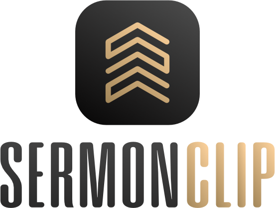

# SermonClip

<p align="center">
  <picture>
    <source media="(prefers-color-scheme: dark)" srcset="Sources/SermonCut/Resources/SermonClip-Darkmode-Logo.png">
    <source media="(prefers-color-scheme: light)" srcset="Sources/SermonCut/Resources/SermonClip-Lightmode-Logo.png">
    
  </picture>
</p>

SermonClip is a local-first macOS app for extracting a sermon from a full church-service recording, preparing subtitles, adding opening and closing bumpers, and exporting finished media.

## Requirements

- Apple Silicon Mac
- macOS Tahoe 26 or later

## Installing SermonClip

1. Download the latest DMG from the [GitHub Releases page](https://github.com/neatlee/SermonClip/releases).
2. Open the DMG.
3. Drag `SermonClip.app` to the Applications folder.
4. Eject the DMG and open SermonClip from Applications.

Because the app is not notarized through the Mac App Store, macOS may show a Gatekeeper warning the first time it is launched. If that happens, open **System Settings → Privacy & Security**, scroll to the security message, choose **Open Anyway**, and confirm that you want to open SermonClip. Only do this for a copy downloaded from the official SermonClip repository or website.

## Updating SermonClip

Download the newer DMG and replace the existing app in Applications. Quit SermonClip first, then choose **Replace** when Finder asks.

Project data is stored outside the app bundle and is preserved across updates, including:

- Bumper library and defaults
- YouTube description presets
- Export preferences
- YouTube authorization stored in the macOS Keychain

## Homebrew

SermonClip is also available through the [SermonClip Homebrew tap](https://github.com/neatlee/homebrew-sermonclip):

```sh
brew tap neatlee/sermonclip
brew trust --cask neatlee/sermonclip/sermonclip
brew install --cask neatlee/sermonclip/sermonclip
```

If you previously tapped the old `stoneycreekbaptist/sermonclip` location, remove it first:

```sh
brew untap stoneycreekbaptist/sermonclip
brew tap neatlee/sermonclip
brew trust --cask neatlee/sermonclip/sermonclip
```

If SermonClip was already installed from the website, Homebrew can adopt the existing app:

```sh
brew tap neatlee/sermonclip
brew trust --cask neatlee/sermonclip/sermonclip
brew install --cask --adopt neatlee/sermonclip/sermonclip
```

Future updates can be installed with `brew upgrade --cask sermonclip`.

The packaged app includes the Google configuration needed for YouTube connection. You do not need to create a Google project or import a JSON file. Open **YouTube Settings** and choose **Connect to YouTube**. Google may show an app safety warning during the first connection while SermonClip’s OAuth app verification is being completed. If you trust the copy you downloaded, choose **Advanced**, then continue to SermonClip and complete the connection. This warning is separate from the macOS Gatekeeper warning.

## Workflow

1. Select opening and closing bumpers.
2. Choose the service MP4.
3. Set and confirm the sermon start and end times with the waveform controls.
4. Import a trusted SRT, or generate subtitles locally.
5. Review subtitle timing and make any manual adjustments.
6. Choose the export folder and export name.
7. Select MP4 and/or MP3 output. An adjusted SRT is exported when subtitles are present.
8. Optionally upload the finished MP4 and subtitle track to YouTube.

SermonClip supports MP4 and JPG bumpers. JPG bumpers display for six seconds in video exports and are omitted from MP3 audio. Compatible video clips can use the fast, no-reencode export path; incompatible clips are converted automatically.

## YouTube

YouTube authorization tokens are stored in the macOS Keychain, not in project files. See [Using YouTube with SermonClip](YOUTUBE-SETUP.md) for installation, Gatekeeper, connection, export, and upload guidance.

See the [SermonClip Privacy Policy](PRIVACY.md) for a plain-language explanation of local storage, Google/YouTube access, and uploads.

See the [SermonClip Terms of Service](TERMS.md) for the terms governing use of the app.

## Releases

Version history is maintained in [CHANGELOG.md](CHANGELOG.md). DMGs are published on the [GitHub Releases page](https://github.com/neatlee/SermonClip/releases).
